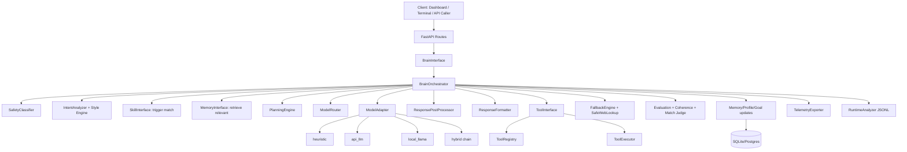
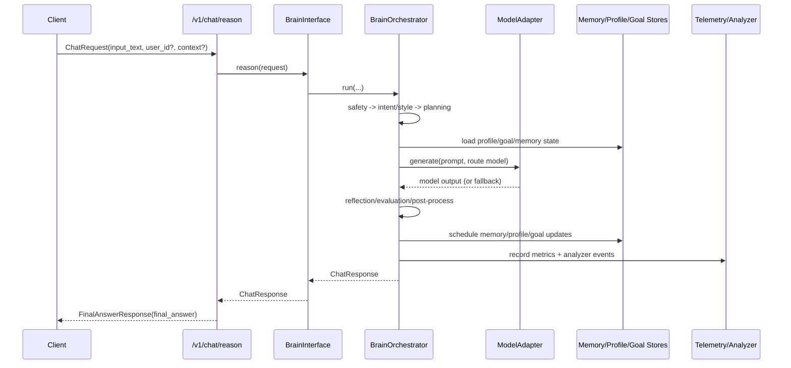
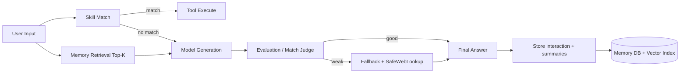

# Humoniod AI: System Blueprint

This README is the technical blueprint of how the system runs end-to-end.

## 1) What This App Does

Humoniod AI is a FastAPI-based chat brain with:
- multi-mode reasoning (`fast`, `balanced`, `deep`)
- model backends (`heuristic`, `api_llm`, `local_llama`, `hybrid`)
- semantic memory + long-term summaries
- skill-triggered tool execution
- companion layer (identity, relationship tone, emotional continuity)
- runtime analyzer and telemetry
- dashboard + system control APIs

User-facing chat endpoints return `final_answer`, while internally the engine builds a full structured `ChatResponse`.

## 2) High-Level Architecture



## 2.1) App Line Diagram (Straight Flow)

```mermaid
flowchart LR
    A[User Message] --> B[/v1/chat/reason]
    B --> C[BrainInterface]
    C --> D[BrainOrchestrator]
    D --> E[Safety + Intent + Memory + Skills]
    E --> F[ModelRouter]
    F --> G[ModelAdapter]
    G --> H[local_llama / api_llm / heuristic]
    H --> I[Post-Process + Guardrails]
    I --> J[Store Memory/Profile/Goals]
    J --> K[Telemetry + Runtime Analyzer]
    K --> L[Final Answer to User]
```

Plain line view:

```text
User -> /v1/chat/reason -> BrainInterface -> BrainOrchestrator
-> Safety/Intent/Memory/Skills -> ModelRouter -> ModelAdapter
-> (local_llama | api_llm | heuristic) -> Post-Processor/Guardrails
-> Memory/Profile/Goal Update -> Telemetry/Analyzer -> Final Answer
```

## 3) Request Lifecycle (Exact Process)

For `POST /v1/chat/reason`:

1. Route validates `ChatRequest` and sets `trace_id` + `user_id` if missing.
2. `BrainInterface.reason()` calls orchestrator with companion mode off.
3. Orchestrator runs safety classifier first.
4. Loads profile, goal, relationship state, emotional state.
5. Detects intent and answer style.
6. Learns from correction phrases (behavior + skills).
7. Retrieves top-k relevant memory context.
8. Builds planning context and execution plan.
9. Routes model (`fast_model` / `creative_model` / `deep_model`).
10. Executes matched skill/tool path (if applicable).
11. Calls model adapter backend (local/api/heuristic/hybrid failover).
12. Runs reflection/evaluation/regeneration loop (depending on config).
13. If weak output: fallback engine and optional safe web recovery.
14. Applies companion filters (identity/tone/guardrails) when enabled.
15. Post-processes answer (shape cleanup + style normalization).
16. Stores memory/profile/goal updates asynchronously.
17. Records telemetry and analyzer state deltas.
18. Returns `FinalAnswerResponse.final_answer` to caller.

## 4) Sequence Diagram



## 5) Key Runtime Modules

| Layer | File | Responsibility |
|---|---|---|
| App bootstrap | `app/main.py` | FastAPI app, middleware, route mounting, startup/shutdown hooks |
| Composition root | `app/core/dependencies.py` | Wires all services, repositories, adapters |
| Chat routes | `app/routes/chat.py` | `/reason`, `/stream`, `/companion`, `/companion/stream` |
| System routes | `app/routes/system.py` | runtime/memory/status/skills/analyzer/dashboard endpoints |
| Brain interface | `app/services/brain/brain_interface.py` | thin app-facing brain API |
| Orchestrator | `app/services/brain/orchestrator.py` | full request pipeline |
| Model adapter | `app/services/brain/model_adapter.py` | backend execution + failover |
| Memory | `app/services/memory/*` | storage, retrieval, summarization, ranking |
| Skills | `app/services/skills/*` | trigger matching and skill persistence |
| Tools | `app/services/tools/*` | controlled tool execution and safety |
| Telemetry | `app/core/telemetry_exporter.py` | metrics snapshots and Prometheus output |
| Analyzer | `app/core/runtime_analyzer.py` | runtime state change logging (`jsonl`) |

## 6) Model Backend Logic

Configured by `MODEL_BACKEND`:

- `heuristic`: deterministic app-generated output path.
- `api_llm`: OpenAI-compatible chat completion endpoint.
- `local_llama`: llama-cpp GGUF local inference.
- `hybrid`: ordered chain failover.

Hybrid chain:
- `api_llm -> local_llama -> heuristic`

Effective backend can differ from configured backend during failover.  
Check `/v1/system/runtime`:
- `model_backend_configured`
- `model_backend_effective`

## 7) Memory + Skill + Tool Flow



## 8) Companion Mode Working

Companion mode endpoints:
- `POST /v1/chat/companion`
- `POST /v1/chat/companion/stream`

Behavioral stack:
- identity filter (`IdentityCore`)
- relationship tone (`RelationshipStateEngine`)
- emotional continuity (`EmotionalContinuityEngine`)
- safety guardrails (`SafetyGuardrails`)

Session behavior:
- if `user_id` absent, server creates cookie `humoniod_companion_sid`.
- same user/cookie keeps continuity.

## 9) Storage Blueprint

Default DB driver: `sqlite` (`data/humoniod_memory.db`)  
Alternative: `postgres` via `POSTGRES_DSN`.

Main persisted domains:
- memories
- profile
- goals
- skills
- relationship state/memory
- emotional logs/snapshot

Runtime analyzer file:
- `data/runtime_analyzer.jsonl`

Privacy-by-default behavior:
- sensitive strings are redacted before memory persistence (email/phone/card/pan/aadhaar/token)
- sensitive context keys are dropped before summary memory storage
- relationship state keeps numeric tone signals, but text snippet persistence is disabled by default
- terminal chat script does not log chat text unless `-LogPath` is explicitly set

## 10) System APIs for Monitoring and Control

Base: `/v1/system`

- `GET /runtime` -> config + effective backend + readiness flags
- `GET /memory` -> memory health + embedding metadata
- `GET /status` -> global health + telemetry snapshot
- `GET /skills` -> skill list by user
- `POST /skill` -> create/update skill
- `DELETE /skill/{id}` -> delete skill
- `GET /analyzer` -> runtime state-change records
- `GET /dashboard` -> HTML control panel

## 11) Startup and Verification

### Git Setup (first step)

If repo not connected yet:

```powershell
powershell -ExecutionPolicy Bypass -File scripts/bootstrap_git.ps1 -RemoteUrl "https://github.com/<you>/<repo>.git"
```

First push:

```powershell
git add .
git commit -m "initial production-ready setup"
git push -u origin main
```

### Local Llama launch

```powershell
.\scripts\start_local_llama_final.ps1
```

### Verify runtime

```powershell
.\scripts\verify_local_runtime.ps1
```

Expected:
- `backend_configured=local_llama`
- `backend_effective=local_llama`
- `model_ready=True`

### Open dashboard

```text
http://127.0.0.1:8000/v1/system/dashboard
```

### One-command optimize (space + fast profile)

```powershell
.\scripts\optimize_space_and_speed.ps1 -CreateRuntimeZip
```

Start low-latency runtime after cleanup:

```powershell
.\scripts\optimize_space_and_speed.ps1 -StartFastServer
```

### Server Autopilot (online-time auto handling)

Run autopilot directly:

```powershell
powershell -ExecutionPolicy Bypass -File scripts/server_autopilot.ps1 `
  -OnlineFrom 09:00 -OnlineTo 23:30 -OfflineMode heuristic
```

What it does:
- online window: runs `local_llama` profile
- offline window: switches to low-cost profile (`heuristic` or `local_light`)
- health checks every few seconds
- if server goes down, auto-restarts
- privacy mode enabled by default (PII redaction + sensitive context key drop)
- keeps state/log in:
  - `data/server_autopilot_state.json`
  - `data/server_autopilot.log`

Install as Windows startup task (recommended):

```powershell
powershell -ExecutionPolicy Bypass -File scripts/install_server_autopilot_task.ps1 `
  -OnlineFrom 09:00 -OnlineTo 23:30 -OfflineMode heuristic
```

Remove startup task:

```powershell
powershell -ExecutionPolicy Bypass -File scripts/uninstall_server_autopilot_task.ps1
```

### Full-Day Update Runner (progress snapshots + short report)

Run a full-day monitor that captures runtime/status/memory/skills/analyzer and writes
change-only JSONL snapshots with a short summary at the end:

```powershell
powershell -ExecutionPolicy Bypass -File scripts/full_day_update_runner.ps1 `
  -BaseUrl http://127.0.0.1:8000 `
  -UserId dashboard-user `
  -DurationHours 12 `
  -PollMinutes 15
```

Output files:
- `data/daily_updates/full_day_update_<timestamp>.jsonl`
- `data/daily_updates/full_day_summary_<timestamp>.txt`

Quick test:

```powershell
powershell -ExecutionPolicy Bypass -File scripts/full_day_update_runner.ps1 -RunOnce
```

### Online Brain Trainer (LLM-assisted repeated training requests)

Runs repeated chat rounds against a live URL, records answers, and auto-stops on degraded health or repeated errors:

```powershell
powershell -ExecutionPolicy Bypass -File scripts/online_brain_trainer.ps1 `
  -BaseUrl https://unblemished-ai.onrender.com `
  -UserId online-train-user `
  -MaxRounds 300 `
  -DelaySeconds 2 `
  -TargetPassRate 0.8 `
  -RollingWindow 20 `
  -MinRoundsPerPool 20 `
  -StopOnDegraded
```

Optional auth:

```powershell
  -AuthHeader x-api-key -AuthValue <YOUR_API_KEY>
```

Output files:
- `data/daily_updates/online_brain_train_<timestamp>.jsonl`
- `data/daily_updates/online_brain_train_summary_<timestamp>.txt`

### Any-Server Easy Push/Deploy (Linux/AWS)

Project now includes containerized deploy:
- `Dockerfile`
- `docker-compose.yml`
- `.env.example`
- `scripts/deploy_server.sh`
- `scripts/update_server.sh`

On server (Ubuntu/AWS EC2):

```bash
# one-time tools
sudo apt-get update
sudo apt-get install -y git docker.io docker-compose-plugin curl
sudo usermod -aG docker $USER
newgrp docker
```

First deploy:

```bash
bash scripts/deploy_server.sh https://github.com/<you>/<repo>.git main /opt/humoniod-ai
```

Then set your runtime env:

```bash
cd /opt/humoniod-ai
cp .env.example .env   # if not already created
nano .env
```

Important `.env` values:
- `DATABASE_DRIVER=postgres`
- `POSTGRES_DSN=postgresql://postgres:<URLENCODED_PASSWORD>@db.<project-ref>.supabase.co:5432/postgres?sslmode=require`
- Render free profile:
  - `MODEL_BACKEND=heuristic`
  - `LOCAL_MODEL_PATH=`
- Paid/local-llama profile:
  - `MODEL_BACKEND=local_llama`
  - `LOCAL_MODEL_PATH=/models/<your-model>.gguf`
  - `MODEL_VOLUME_PATH=/opt/models` (in shell/export for compose or set default path)
- privacy flags:
  - `PRIVACY_REDACTION_ENABLED=true`
  - `PRIVACY_REMOVE_SENSITIVE_CONTEXT_KEYS=true`
  - `RELATIONSHIP_MEMORY_TEXT_ENABLED=false`

Restart after env edits:

```bash
docker compose up -d --build
```

Update server after new push:

```bash
cd /opt/humoniod-ai
bash scripts/update_server.sh main
```

## 12) Fast Troubleshooting Map

1. If response looks generic template-like:
- check `/v1/system/runtime` backend is actually `local_llama`.
- ensure model file exists and llama-cpp imports.
- reduce strict/self-eval loops if over-triggering fallback.

2. If skill not triggering:
- verify same `user_id` in dashboard and chat request.
- verify trigger text/type and `active=true`.
- check `/v1/system/status` tool usage counters.

3. If analyzer says backend `heuristic`:
- env not applied to running process.
- restart server with startup script.
- re-check runtime endpoint.

## 13) Important Config Flags

Core:
- `MODEL_BACKEND`
- `LOCAL_MODEL_PATH`
- `REASONING_MODE`
- `STRICT_RESPONSE_MODE`
- `SELF_EVALUATION_ENABLED`
- `RESPONSE_MATCH_MODEL_ENABLED`

Internet fallback:
- `INTERNET_LOOKUP_ENABLED`
- `INTERNET_LOOKUP_TIMEOUT_SECONDS`
- `INTERNET_LOOKUP_MAX_RESULTS`
- `INTERNET_LOOKUP_MAX_CHARS`

Privacy:
- `PRIVACY_REDACTION_ENABLED`
- `PRIVACY_REMOVE_SENSITIVE_CONTEXT_KEYS`
- `RELATIONSHIP_MEMORY_TEXT_ENABLED`

Security:
- `AUTH_ENABLED`
- `AUTH_MODE`
- `AUTH_API_KEY_HEADER`
- `AUTH_API_KEY`
- `RATE_LIMIT_ENABLED`
- `REQUESTS_PER_MINUTE`

## 14) OOPM Status (Whole App)

OOPM (Object-Oriented Programming Model) already applied across core app:
- service layer is class-based (`BrainOrchestrator`, `ModelAdapter`, `MemoryInterface`, `SkillInterface`)
- dependency wiring is class-driven container (`ServiceContainer`)
- repositories are class implementations (SQLite/Postgres variants)
- behavior engines are class modules (evaluation, style, safety, routing)

Intentionally functional (by framework design):
- FastAPI route handler functions in `app/routes/*`
- small stateless helpers/parsers in `app/core/config.py` and helper modules

Net result:
- core runtime logic = OOP
- thin framework boundary functions = functional wrappers

---

If you want, next step I can add one more section in README: **"Single message walkthrough"** where one real example input is traced through each internal module with exact file references.
